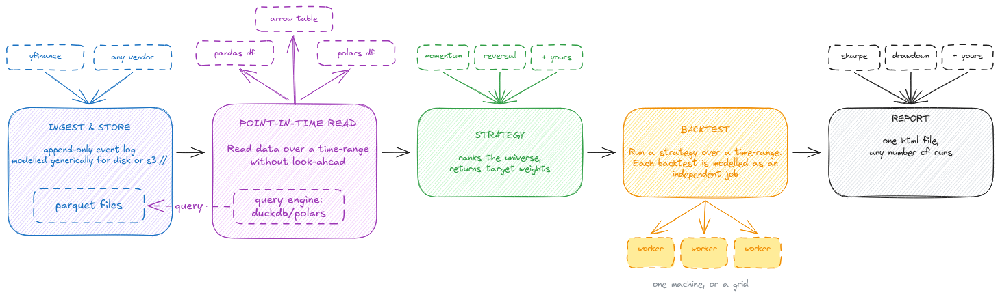

# backtester

## Prerequisites

[uv](https://docs.astral.sh/uv/) — that is all.

```bash
curl -LsSf https://astral.sh/uv/install.sh | sh      # or: brew install uv, pipx install uv
```

Docker is needed only for a production-like deployment, not for local testing.

## Running it locally

```bash
uv sync
source .venv/bin/activate          # or prefix each command below with `uv run`

backtester ingest                                 # fetch data; the only step needing network
backtester run configs/momentum.yaml              # three backtests, one per lookback
backtester report out/* --out out/report.html
```

Three runs because a config file is a list of backtests, and that one holds
three: momentum over 20, 30 and 60 days. Settings they share are written once
and pulled in with `<<: *base`, which is ordinary YAML:

```yaml
- &base
  strategy:
    name: trailing_return
    params: {lookback_sessions: 20, direction: 1, top_fraction: 0.2, bottom_fraction: 0.2}
  universe: us-liquid-30
  start: 2020-01-01
  end: 2025-01-01
  cost_bps: 10.0

- <<: *base
  strategy:
    name: trailing_return
    params: {lookback_sessions: 30, direction: 1, top_fraction: 0.2, bottom_fraction: 0.2}
```

A file with a single backtest in it is written plainly, without the list.

Each run writes its own folder. The report takes as many folders as you give it
and produces one page: a tab per run, plus a tab comparing them.

Progress goes to stderr and the result lines to stdout, so
`backtester run ... > runs.txt` keeps just the folders. Add `--quiet` for errors
only, or `--debug` to see every rebalance.


## Design



- Data is an append-only log where every row records both when something happened and when we learned
it, so a decision can only ever see what was already known.
- Strategies are generic interfaces that take in market data and return a ranking of equities along with weights (to distribute capital).
- Backtests are modelled as a job that can be run locally, in a process pool or in a grid. After execution, it stores results in a file.
- Reports operate on the files generated by the backtest. This is done because backtests can run on a grid and store results independantly and we can simply run report generation on the files; decoupling report generation from the backtest run.


| Package | Responsibility |
|---|---|
| `backtester.data` | fetch, store, read back point-in-time |
| `backtester.strategy` | interface to implement strategies that are run by the engine |
| `backtester.engine` | run a strategy over history as a unit of work |
| `backtester.report` | generate report from the backtesting result |

[`docs/DESIGN_DECISIONS.md`](docs/DESIGN_DECISIONS.md) has some of the important decision behind this, including the ones deliberately not taken.

## Usage overview
[`docs/USER_GUIDE.md`](docs/USER_GUIDE.md) has detailed snippets for each thing you might want to do — S3, dataframe formats, process pools, grids, metrics. Below is for a brief overview.

### Adding a strategy

```python
class VolAdjustedMomentum(Strategy):
    lookback_sessions = 60            # history needed, in trading sessions

    def allocate(self, view: MarketView) -> Allocation:
        prices = view.read(PRICES)    # already bounded: no date filters, no future
        scores = ...                  # {ticker: score}
        return rank_weights(scores, top_fraction=0.2, bottom_fraction=0.2)
```

You decide how much goes into each name. Here `rank_weights` splits the money evenly across the ones you pick, but you can decide allocation. The engine simply uses the allocation deicded by your strategy.

Complete and runnable: [`examples/custom_strategy.py`](examples/custom_strategy.py).

### Running one

**From a notebook.** Pass the object, no registration:

```python
result = run_backtest(
    BacktestSpec(
        universe=("AAPL", "MSFT", "NVDA"),
        start=at_close(2020, 1, 1),
        end=at_close(2024, 12, 31),
        strategy=VolAdjustedMomentum(60),
        as_of_knowledge=latest_knowledge_ts(ref),
    ),
    ref,
)
compute(result)["net_sharpe"]        # 0.27
```

**From the CLI.** Add a line to `STRATEGIES` in
`backtester/strategy/__init__.py` so a config can name it:

```yaml
# configs/vol_adjusted.yaml
strategy:
  name: vol_adjusted
  params: {lookback_sessions: 60, top_fraction: 0.2}
universe: us-liquid-30
start: 2020-01-01
end: 2024-12-31
rebalance_frequency: M          # M | W | D
execution_lag_sessions: 1       # decide on close of t, hold from t+1
cost_bps: 10.0
point_in_time: true
```

```bash
backtester run configs/vol_adjusted.yaml
# out/<hash of the spec>  59 periods  final equity 1.39
```

The notebook path is for iterating; the CLI path is what a queue or a cron job
drives. A notebook-defined strategy still saves its result, but records that it
cannot be rebuilt, since nothing elsewhere can look the class up.

Results are written, not printed. `out/<id>/` holds `spec.json` and three
parquet files, named by a hash of the spec, so re-running overwrites and
different parameters land elsewhere.

### Many at once, on a grid

Everything needed to run a backtest fits in a small piece of text, so one
backtest can be sent to another machine as a message. There are two examples: one
writes the messages, the other reads a message and runs it.

This is a proof of concept, not a deployment. It uses a pipe where a real setup
would use a queue, but the two halves are the ones you would actually deploy.

```bash
python examples/grid_submit.py > queue.jsonl

while read -r message; do
    echo "$message" | STORE_ROOT=./data/us-equities OUT_ROOT=out python examples/grid_worker.py
done < queue.jsonl
```

```
7d86e6742c78f137  ->  out/7d86e6742c78f137
85ec88486a52e855  ->  out/85ec88486a52e855
3c070a38bc2f0db1  ->  out/3c070a38bc2f0db1
```

The machines never talk to each other. A result folder is named after the
settings that produced it, so no two runs can collide, and sending the same
message twice writes to the same folder instead of giving you two answers.

The message says what to run, never where the data is. That comes from
`STORE_ROOT`, which is why the same message works against a local folder here
and against S3 on a grid.

To use several cores on one machine instead of several machines, the same
backtests run in a process pool:
[`examples/parallel_sweep.py`](examples/parallel_sweep.py).

### The report

```bash
backtester report out/* --out out/report.html
```
Can also be used to create a consolidated report of many backtests

### Adding a metric

One function and one line. The renderer iterates `METRICS` and never names one.

```python
def worst_period(result: BacktestResult) -> float:
    return _number(result.returns["net_return"].min())

METRICS = (..., Metric(
    key="worst_period",
    label="Worst period",
    compute=worst_period,
    unit="percent",              # "percent" | "ratio"
    higher_is_better=True,       # None where neither direction is better
))
```

It gets a sortable column and its own tinting. Add its key to `headline` in
`report/html.py` to put it in the KPI tiles.

## Deployment

Everything above assumes you are at a terminal with the repository checked out.
This section runs the same commands inside a container instead, for machines
where nobody is watching: cron, CI, a grid. The container brings its own Python,
so the host only needs Docker.

There are two independent jobs with the data store between them. Neither is a
server; each one starts, does its work, and exits.

- **Ingestion** downloads prices and writes them to the store. It is the only
  part that uses the network, and it produces no file of its own. The store is
  its output.
- **Backtests** read the store and write their results. They never use the
  network, and they do not talk to each other, so you can run as many at once as
  you have machines for.

Splitting them is what makes a backtest repeatable. If the data provider is
slow, down, or quietly returns a different answer today, only the ingestion job
sees it. A backtest reads what is already stored, so it gives the same result
next week as it did today.

```bash
docker build -t backtester .
docker run --rm -v "$PWD/data:/data" backtester ingest --root /data/us-equities
docker run --rm -v "$PWD/data:/data:ro" -v "$PWD/out:/out" backtester \
  run configs/momentum.yaml --root /data/us-equities --out /out
```

Ingestion is the job you would schedule, because new prices arrive daily:

```cron
0 6 * * 1-5  docker run --rm -v /srv/data:/data backtester ingest --root /data/us-equities
```

Nothing in the repository sets up a scheduler, and nothing needs to. It is the
same command you would run by hand, so anything that can run a command can run
this.

The store can sit on S3 rather than a local directory, which is what lets many
machines read the same data. Only the root changes, and credentials come from
the environment as they would for any AWS tool:
[`docs/USER_GUIDE.md`](docs/USER_GUIDE.md#pointing-at-the-data).

Logs go to stderr rather than to a file, which is what cron, Docker and job
schedulers already know how to collect.

## More

- [`docs/USER_GUIDE.md`](docs/USER_GUIDE.md) has a snippet for each thing you might want to do — S3, dataframe formats, process pools, grids, metrics.
- [`docs/DESIGN_DECISIONS.md`](docs/DESIGN_DECISIONS.md) — why they are that way
- [`docs/ASSUMPTIONS.md`](docs/ASSUMPTIONS.md) — every judgement call, including
  the ones that make these results optimistic
- [`examples/`](examples/) — runnable versions of everything above
